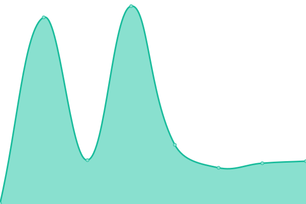

<!--start: description-->

Hello! I'm sonyakun. I'm good at Python.

I hosting BedrockConnect on FriendList. (Currently, resources cannot be reserved for BedrockConnect, so it will be connected to a public instance.)

<!--end: description-->
  
## Skills
  

## [📈 BedrockConnect Status](https://bc.sonyakun.com): <!--live status--> **🟧 Partial outage**

<!--start: status pages-->
<!-- This summary is generated by Upptime (https://github.com/upptime/upptime) -->
<!-- Do not edit this manually, your changes will be overwritten -->
<!-- prettier-ignore -->
| URL | Status | History | Response Time | Uptime |
| --- | ------ | ------- | ------------- | ------ |
|  [Google](https://www.google.com) | 🟩 Up | [google.yml](https://github.com/upptime/upptime/commits/HEAD/history/google.yml) | 

 170ms
     
 | 

<a href="https://demo.upptime.js.org/history/google">100.00%</a>
    

<!--end: status pages-->